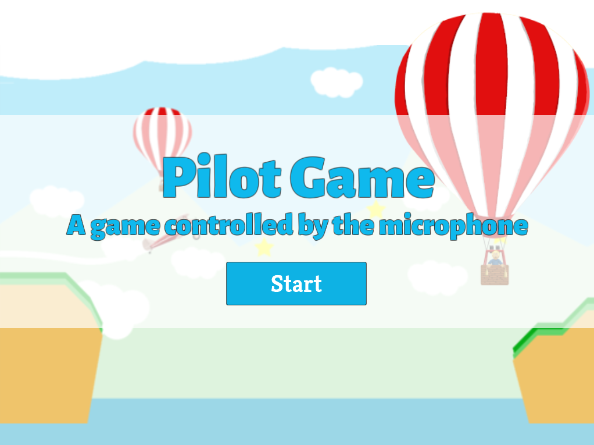
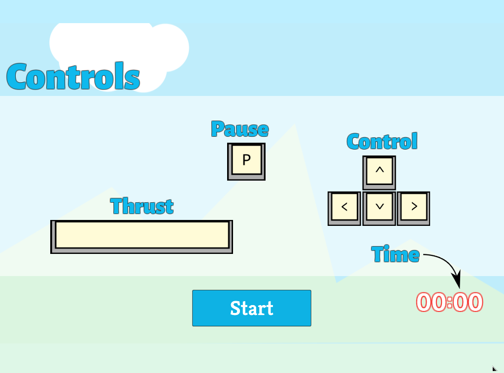
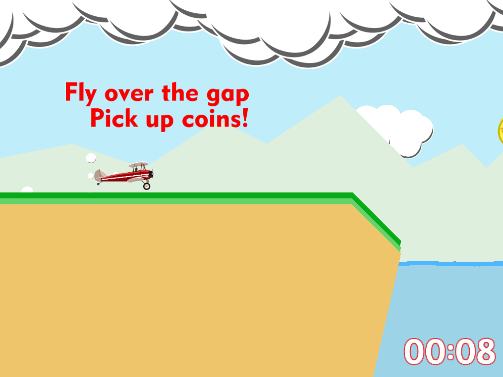
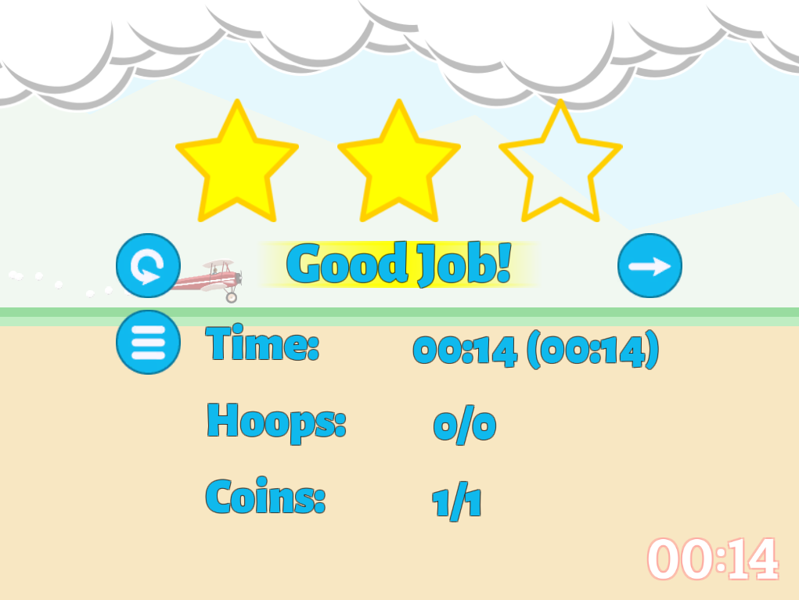

# PilotGame

PilotGame is a speech-powered plane-flying game. It was developed during my PhD research into designing games for collecting human-subject data.

[Play it online](https://davidgundry.itch.io/pilotgame)

>**Note:** The game was originally built for web using the Unity Plugin. Unity has now switched to building to WebGL, which does not provide access to the microphone. While there are workarounds I have not gone back to implement these. Microphone access has been disabled to allow the game to be demonstrated.

## Research Background

This game was created as part of my research into eliciting human-subject data using games. It was part of research into getting players to speak to games. As such, the core mechanic of the game is controlled by the user's microphone input. A syllable detection algorithm is used to identify speech.

The game was incorporated within an experiment allows the player to play for 5 minutes before delivering a questionnaire. TelemetryTools was used to handle uploading the data to a server.

## Screenshots

